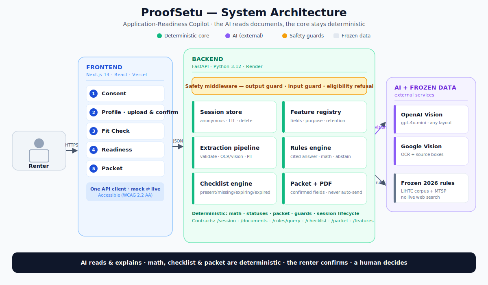

# ProofSetu — Application-Readiness Copilot

> **RealDoor · Hack-Nation 6.0 · Challenge 3.** A renter-controlled assistant that turns
> household documents into a human-confirmed profile, explains published housing rules with
> citations, runs deterministic calculations, flags missing/expired documents, and produces a
> renter-controlled packet — **without ever deciding eligibility.**

**Live:**
- 🌐 Frontend (Vercel): **https://proof-setu.vercel.app**
- ⚙️ Backend (Render): **https://proofsetu.onrender.com** — health: [`/health`](https://proofsetu.onrender.com/health) · API docs: [`/docs`](https://proofsetu.onrender.com/docs)

---

## 1. Problem & solution

Applying for affordable housing (LIHTC) means assembling confusing paperwork under rules most
renters can't easily read, then hoping nothing is missing or expired. **ProofSetu** reads a
renter's documents, shows exactly what it found (with the renter confirming every value),
explains the relevant 2026 rules with citations, computes the deterministic income facts, tells
the renter which documents are present / missing / expiring / expired, and assembles a packet the
renter downloads or shares. It **prepares**; a **qualified human decides**.

## 2. Responsible-AI boundary (non-negotiable)

ProofSetu **never** approves, denies, scores, ranks, recommends, predicts, or determines
eligibility. The design enforces this at multiple layers:

- **AI at the edges only.** A vision model reads documents and phrases grounded explanations.
  Everything consequential — math, checklist status, packet contents, guards, session lifecycle —
  is **deterministic code**, not model opinion.
- **Data minimization.** Full SSNs and full government-ID numbers are never stored or shown
  (last-4 only). A PII-redaction guard enforces this even in the flexible extraction path.
- **Output guard.** Every JSON response is scanned; verdict/score/rank language is blocked and
  replaced with a safe, factual pattern.
- **Input guard.** Document text is treated as untrusted data — embedded instructions
  ("ignore previous instructions", "approve this applicant") are detected and neutralized.
- **Renter control.** Every value is confirmable/correctable; the packet uses confirmed fields
  only and never auto-sends; a "Delete everything" control flushes the session on demand.
- **Transparency.** `GET /features` publishes every field the system may extract, its purpose,
  and its retention.

## 3. The frozen renter journey (5 screens)

| # | Screen | What happens |
|---|---|---|
| 1 | **Consent** | Plain-language data-use notice → creates an anonymous, time-limited (TTL) session. Persistent "Delete everything" control. |
| 2 | **Profile** | Household size + document upload → OCR/vision extraction with confidence; the renter confirms/corrects each field. Corrections flow to the confirmed profile. |
| 3 | **Fit Check** | Ask a program-rule question → grounded, cited answer + deterministic math (annualized income vs. the frozen MTSP limit) + effective date. **No verdict.** Eligibility questions get a safe refusal. |
| 4 | **Readiness** | Gold-checklist engine returns each required document as **present / missing / expiring / expired** with a fix hint, computed from the renter's confirmed documents. |
| 5 | **Packet** | Confirmed-fields-only summary → preview → **PDF download** (or accessible HTML) → optional share → delete. Never auto-sends. |

*Qualified human review happens **outside** this flow.*

## 4. Architecture

<p align="center">
  
</p>

**Principle:** the AI (OpenAI/Google Vision) is confined to *reading documents*. Rules, math,
checklist, packet, guards, and session lifecycle are deterministic Python. The frontend never
calls `fetch` directly — all traffic goes through one API client with a **mock ⇄ live** switch,
so the whole UI is demoable even if a backend is unavailable.

### End-to-end data flow
1. **Consent** → `POST /session` creates an anonymous session with a TTL.
2. **Upload** → `POST /documents`: file validation (magic-byte sniff) → extraction → allowlisted
   (or dynamic) fields with confidence + source evidence → `needs_confirmation`.
3. **Confirm/correct** → `PATCH /documents/{id}/fields` marks a field confirmed/corrected and
   writes it to the session's confirmed profile (downstream results become stale → recompute).
4. **Fit Check** → `POST /rules/query` retrieves a frozen corpus chunk, runs deterministic math
   on the confirmed income, returns a cited answer or abstains. Eligibility questions → refusal.
5. **Readiness** → `GET /checklist?program=lihtc&session_id=…` evaluates the confirmed documents.
6. **Packet** → `POST /packet` (confirmed fields only) → `GET /packet/{id}/pdf`.
7. **Delete** → `DELETE /session/{id}` flushes session, confirmed fields, and packets.

## 5. Tech stack

| Layer | Technology | Notes |
|---|---|---|
| **Frontend** | Next.js 14 (App Router), React, TypeScript, Tailwind CSS | 5 screens; WCAG 2.2 AA essentials (focus management, ARIA live, reduced-motion, word+icon status); mock/live API client |
| **Backend** | FastAPI, Uvicorn, Pydantic v2 (Python 3.12) | `backend/` package; routing + CORS in `main.py`; global output-guard middleware |
| **Extraction** | OpenAI Vision (`gpt-4o-mini`, Structured Outputs) · Google Cloud Vision OCR · PyMuPDF (PDF→image) · fixture fallback | provider-swappable; PII redaction |
| **Rules / data** | Frozen 2026 LIHTC rule corpus + HUD MTSP thresholds (JSON) · deterministic Python | keyword retrieval; no live web search |
| **PDF** | fpdf2 (pure Python) + accessible HTML fallback | no native system deps → deploys anywhere |
| **Session** | In-memory store with TTL (Upstash Redis adapter interface ready) | anonymous, short-lived |
| **Hosting** | Vercel (frontend) · Render (backend) | free tiers; deploy from `develop` |
| **CI** | GitHub Actions | lint/tests on every PR to `develop` |

## 6. How extraction works (the interesting part)

Extraction is **provider-swappable** and **safe-by-default**, controlled by env vars:

**Providers**
- `fixture` *(default, offline)* — deterministic canned responses with stored source boxes;
  guarantees a working demo with zero external calls.
- `OCR_PROVIDER=google` — **Google Cloud Vision** returns text + **word bounding boxes**; the
  deterministic mapper turns those into fields **with real source-evidence boxes**.
- `VISION_PROVIDER=openai` — **OpenAI vision** reads the document *semantically*, so it handles
  arbitrary layouts (no boxes). Best for real-world documents.

**Modes** (`EXTRACTION_MODE`)
- `allowlist` *(default, data-minimized)* — only the published allowlisted fields per document
  type are extracted/returned. Strongest privacy posture.
- `dynamic` — returns **every field the model identifies**, adapting to each document, with a
  **PII-redaction guard** (SSN / full ID / account numbers → last-4 only).

**Fallback chain:** vision → OCR → fixture. Any provider error degrades gracefully so an upload
never hard-fails.

**Supported inputs:** PDF, JPG, PNG (size-capped). PDFs are rasterized with PyMuPDF (no poppler
needed). Allowlisted document types: **pay stub, benefit letter, bank statement, government ID.**

## 7. Backend API

| Method | Path | Purpose |
|---|---|---|
| `GET` | `/health` | Liveness + effective config (build, providers, mode) |
| `POST` · `DELETE` | `/session` · `/session/{id}` | Create session (TTL) · delete all session data |
| `POST` | `/documents` | Upload → classify → extract (confidence + source box) |
| `PATCH` | `/documents/{id}/fields` | Confirm/correct a field → confirmed profile |
| `GET` | `/profile` | Confirmed fields only |
| `POST` | `/rules/query` | Grounded, cited answer + deterministic facts, or abstain |
| `GET` | `/checklist?program=lihtc` | Deterministic present/missing/expiring/expired |
| `POST` · `GET` | `/packet` · `/packet/{id}[/pdf,/html]` | Assemble + export the renter packet |
| `GET` | `/features` | Feature registry: fields, purpose, retention |

Response shapes are frozen in [`contracts/`](contracts/). The frontend builds against them as
mock fixtures, and live services return the same shapes.

## 8. Safety controls

| Control | Behavior |
|---|---|
| Eligibility refusal | Personal "am I eligible?" questions → mandated safe refusal (rule + confirmed value + human-decides), never a verdict |
| Output guard (middleware) | Every JSON response scanned; verdict/score/rank language blocked and replaced |
| Input guard | Injection phrases in document text detected + neutralized; document text treated as data |
| PII redaction | Full SSN / government-ID / account numbers reduced to last-4 |
| Delete | Flushes session, confirmed fields, packets, temp state |
| No auto-send | Packet is renter-downloaded/shared only |

## 9. Repository layout & branch model

```
frontend/          Next.js app (Member 1)   ── app/ · components/ · lib/api (mock+live) · mocks/
backend/           FastAPI (Python package)
  main.py          routing, CORS, output-guard middleware (Member 4)
  extraction/      upload, OCR/vision, allowlists, mapper, PII, guards (Member 2)
  rules/           frozen-corpus retrieval + deterministic calculations (Member 3)
  checklist/       gold-checklist engine (Member 4)
  packet/          assembly + PDF/HTML export (Member 4)
  guards/          output/input guards, eligibility refusal (Member 4)
  store/ · profile/ · registry/   session, confirmed profile, feature registry (Member 4)
contracts/         frozen request/response JSON shapes
data/reference/    frozen 2026 LIHTC corpus + MTSP thresholds
docs/              handoffs + DEPLOY guide
```

- **`main`** — protected/archival; untouched during the hackathon.
- **`develop`** — integration + deployment branch; all PRs target it; the submission deploys
  from here.
- **`feat/*`** — per-member feature branches → PR → `develop`.

## 10. Local development

**Backend**
```bash
python3 -m venv backend/.venv && source backend/.venv/bin/activate
pip install -r backend/requirements.txt
uvicorn backend.main:app --reload          # from the repo root → http://localhost:8000/docs
```

**Frontend**
```bash
cd frontend && npm install
npm run dev                                 # http://localhost:3000  (mock mode by default)
```

Copy `.env.example` → `.env` and fill values locally (never commit `.env`).

## 11. Environment variables (names only)

| Variable | Where | Purpose |
|---|---|---|
| `NEXT_PUBLIC_API_BASE_URL` | frontend | backend URL |
| `NEXT_PUBLIC_API_MODE` | frontend | `live` \| `mock` (deployed builds default to live) |
| `SESSION_BACKEND` · `SESSION_TTL_SECONDS` | backend | session store + lifetime |
| `OCR_PROVIDER` | backend | `google` \| `tesseract` \| `fixture` |
| `VISION_PROVIDER` · `OPENAI_API_KEY` · `OPENAI_VISION_MODEL` | backend | vision extraction (secret key) |
| `GOOGLE_VISION_API_KEY` | backend | Google Cloud Vision (secret) |
| `EXTRACTION_MODE` | backend | `allowlist` \| `dynamic` |
| `MAX_UPLOAD_MB` · `CORS_ORIGINS` | backend | upload cap · allowed origins |

Secrets live only in the deploy dashboards / local `.env` — never in the repo.

## 12. Testing

```bash
pytest -q          # backend + rules + extraction (100+ tests)
cd frontend && npm run build   # typechecks + builds all screens
```

Covered: session lifecycle, checklist status boundaries, packet (confirmed-only + valid PDF),
safety guards (verdict blocking, injection, refusal), extraction (allowlist filtering, PII
redaction, PDF path), and deterministic rules (annualization, thresholds, abstention).

## 13. Deployment

- **Backend → Render** (from `develop`): `uvicorn backend.main:app --host 0.0.0.0 --port $PORT`,
  health check `/health`. Free tier sleeps when idle — wake `/health` before a demo.
- **Frontend → Vercel** (from `develop`, root directory `frontend`).
- **CORS** auto-allows any `*.vercel.app` origin, so the frontend connects with no extra config.

See [`docs/DEPLOY.md`](docs/DEPLOY.md) for step-by-step instructions.

## 14. Known limitations & roadmap

- One metro, one program (LIHTC), one frozen rule year (2026); synthetic documents only.
- Free-tier infrastructure (Render cold starts; ephemeral filesystem).
- Vision mode reads any layout but returns no source-evidence boxes; Google-OCR mode gives boxes
  but is layout-sensitive. A hybrid (OCR boxes + LLM values) is future work.
- Upstash Redis session store is interface-ready but not wired (in-memory is the default).

## 15. Sources & license

- HUD MTSP 2026 income limits and the 2026 LIHTC program rule corpus (frozen organizer copies;
  no live rule search).
- Synthetic demo documents only — no real PII.
